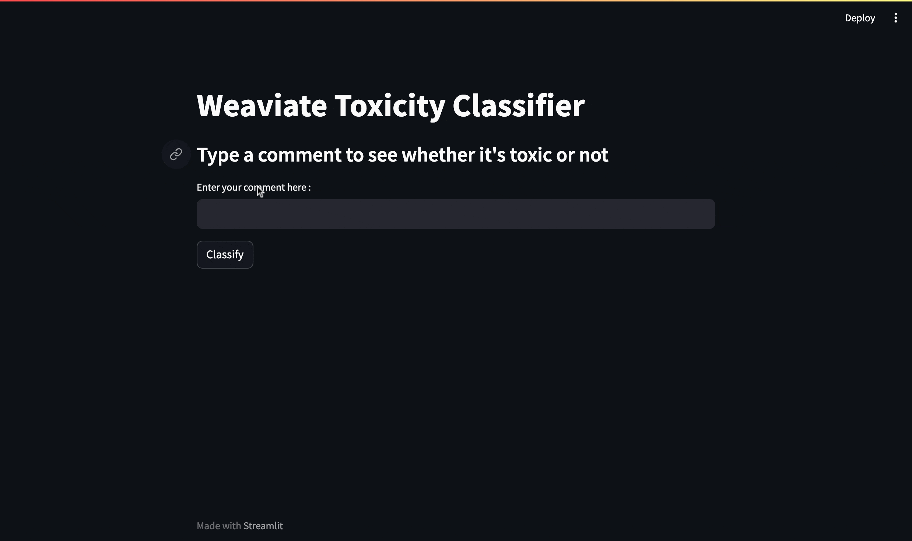

# Toxic Comment Classifier

This project's origin is [here](https://github.com/weaviate/weaviate-examples/tree/main/weaviate-toxic-comment-classifier).

## Overview


In this project, you'll discover the power of semantic search. 
First, we will index the Toxic Comment Classification dataset in Weaviate. 
This dataset comprises two columns: a comment and a binary label indicating whether it is toxic or not. 
When a user enters a comment and wants to determine if it is toxic or not, 
we will conduct a semantic search and display the label of the comment that is most similar to the entered one.

### Contextual classification
This demo relies on the technique called Contextual classification. It involves making predictions about 
cross-references based on the context, without relying on pre-existing training data. 
When you need to assess the similarity between a source item and a potential target item, 
contextual classification is an excellent choice, particularly when your data features 
a robust semantic connection (for instance, like 'The Iconic Statue of Liberty' and 'The Vibrant New York City').

## Technology stack
- Python
- Weaviate
- Streamlit

### Used Weaviate modules/models

[text2vec-contextionary (Contextionary) vectorizer](https://weaviate.io/developers/weaviate/modules/retriever-vectorizer-modules/text2vec-contextionary)  
This vectorizer module is used to build 300-dimensional vectors using a Weighted Mean of Word Embeddings (WMOWE) technique.
Contextionary is Weaviate's own language vectorizer that is trained using [fastText](https://fasttext.cc/) 
on Wiki and CommonCrawl data.  

To be able to use it you need to enable it in the [docker compose file](docker-compose.yml)

## Prerequisites
1. Python3 interpreter installed
1. Ability to execute docker compose 
(The most straightforward way to do it on Windows/Mac is to install 
[Docker Desktop](https://www.docker.com/products/docker-desktop/))

## Setup instructions 

### Start up
1. Clone the repository
1. Create a virtual environment and activate it
    ```shell
    python3 -m venv venv
    source venv/bin/activate
    ```
1. Install all required dependencies 
    ```shell
    pip install -r requirements.txt
    ```
1. Run containerized instance of Weaviate. It also includes vectorizer module to compute the embeddings.

   > **Note**: Make sure you don't have anything occupying port 8080   
   > If you do, you have the option to either stop that process or change the port that Weaviate is using.
    ```shell
    docker compose up
    ```
1. Index the dataset in Weaviate
    ```shell
    python add_data.py
    ```
1. Run the Streamlit demo
   ```shell
   streamlit run app.py
   ```

### Shut down
1. Both streamlit app and docker compose can be stopped with `Ctrl+C` in the corresponding terminal window
2. To remove created docker containers use
```shell
docker compose down
```

## Usage instructions

1. Enter a comment
2. Press `Classify` button to see if it's classified as toxic or not.

## Dataset license

The dataset used for this example is available on Kaggle: 
https://www.kaggle.com/datasets/akashsuper2000/toxic-comment-classification
